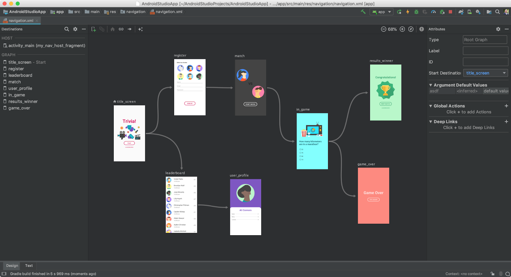
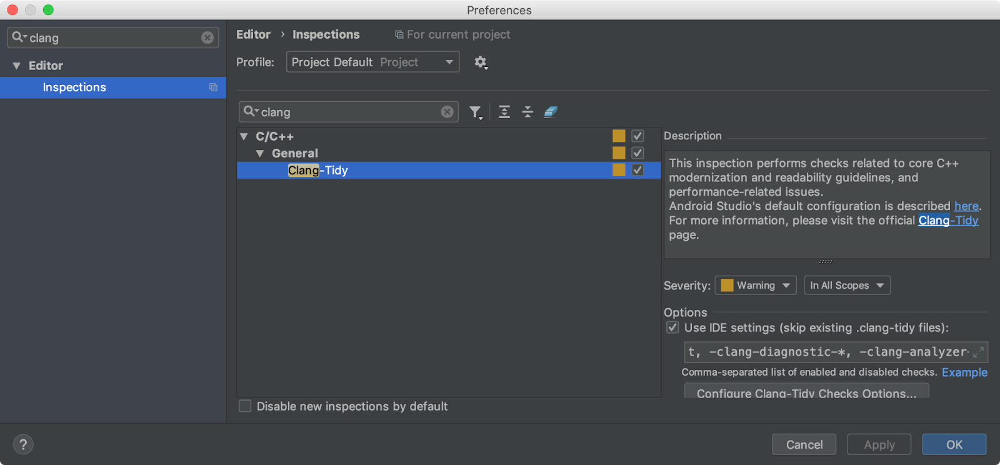
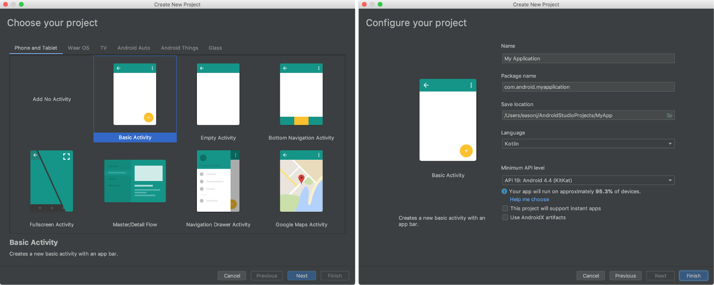
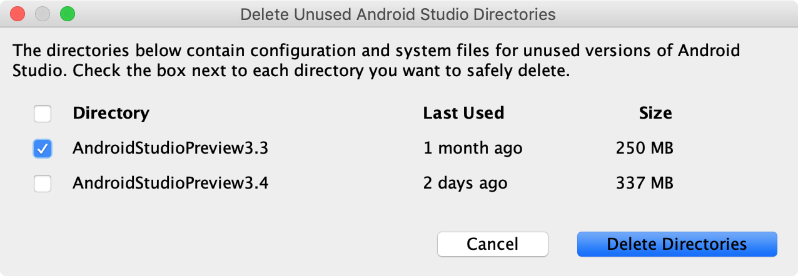
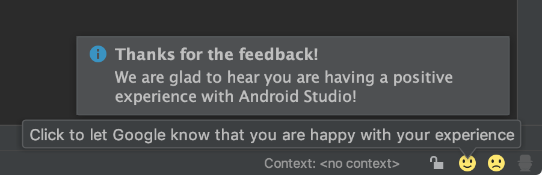
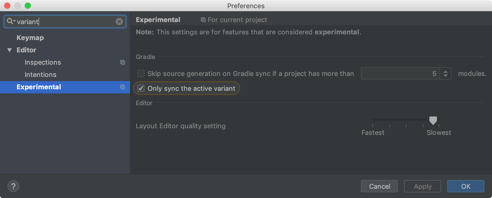
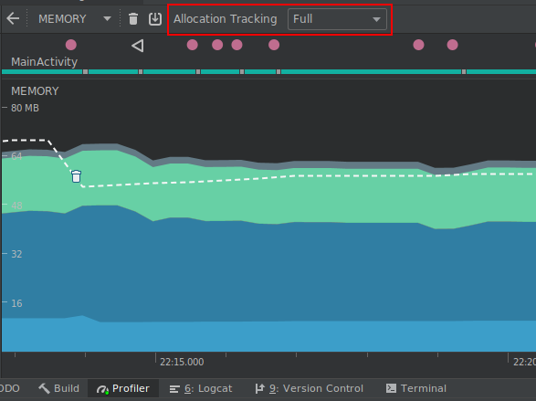
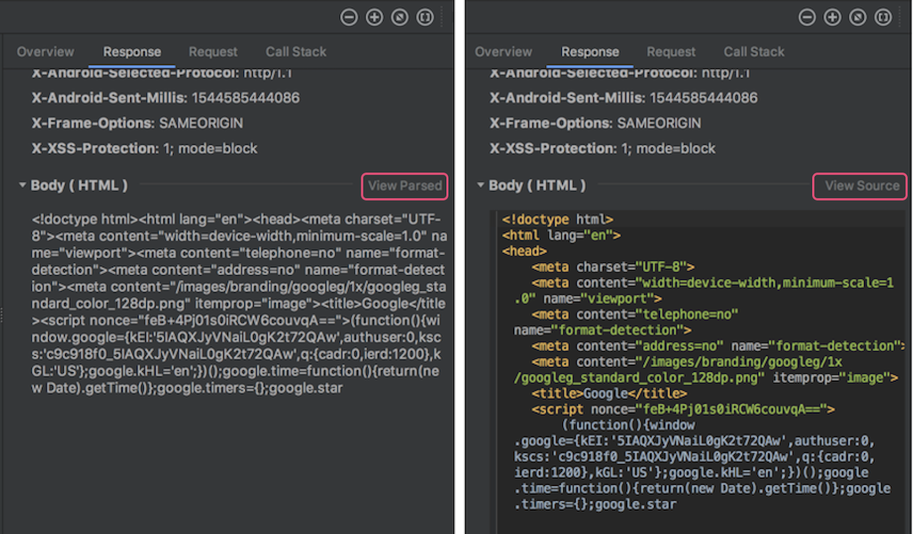
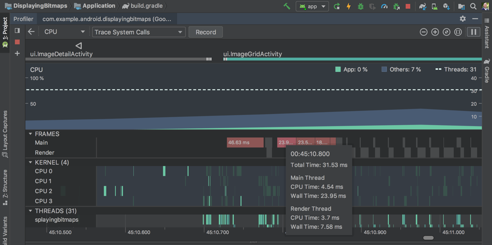

# Android Studio 3.3

原标题：Android Studio 3.3
链接：[https://android-developers.googleblog.com/2019/01/android-studio-33.html](https://android-developers.googleblog.com/2019/01/android-studio-33.html)  
作者：Jamal Eason (产品经理)  
翻译：[arjinmc](https://github.com/arjinmc)  

我们很高兴能够以稳定版本的Android Studio 3.3开始新一年，专注于精致和品质。您今天可以从[developer.android.com/studio](https://developer.android.com/studio/)下载它。根据你们许多人的反馈，我们从大型功能中退了一步，专注于我们的质量基础。我们的目标是确保Android Studio继续帮助您在制作适用于Android的优秀应用时保持高效。自上一个稳定版本发布以来，Android Studio 3.3解决了200多个用户报告的错误。此版本还包括对导航编辑器的官方支持，使用注释处理器时改进的增量Java编译，C ++代码lint检查，更新的新项目向导以及每个性能分析器的可用性修复。此外，在Android模拟器退出时保存快照的速度提高了8倍。

Android Studio 3.3开启了今年更广泛的质量关注领域，我们称之为Project Marble。Project Marble在2018年11月举行的[Android开发者峰会](https://developer.android.com/dev-summit/)上宣布，Android Studio团队致力于使集成开发环境（IDE）的基本功能和流程变得坚如磐​​石，同时精炼和完善面向用户的功能。您在日常的应用开发工作流程中。在[Project Marble](https://youtu.be/ei_5R0CvLm4?t=2286)中，我们特别关注减少崩溃，挂起，内存泄漏和用户影响错误的数量。我们还投资于我们的测量基础设施，以防止这些问题的发生。随着我们在此计划上的进展，请继续关注更多更新和详细信息。

此版本的Android Studio是该产品的一个重要里程碑。如果您想要最新的功能优化和质量，请立即在稳定版本频道上[下载](https://developer.android.com/studio/)Android Studio 3.3。请观看以下内容，了解Android Studio 3.3中的一些重要更改和增强功能。

[视频介绍](https://youtu.be/DdWWsruUXTo)  

## 开发

* <strong>导航编辑器</strong> - 导航编辑器是一个可视化编辑器，允许您构建支持使用新Jetpack导航组件的XML资源。使用导航编辑器和导航组件，您可以在应用的屏幕和内容区域之间建立可预测的交互。此编辑器已在早期的Android Studio版本中预览，但根据您的反馈，我们使用此功能来提高功能的质量。感谢向我们提供反馈的开发者。[了解更多](https://developer.android.com/topic/libraries/architecture/navigation/navigation-implementing)。

  
<small>导航编辑器</small>

* <strong>IntelliJ平台更新</strong> - Android Studio 3.3包括Intellij 2018.2.2。这是Jetbrains的一个重要平台版本，包括代码编辑器的新预览，更新的图标，MacBook Touch Bar支持以及增强版本控制集成。[了解更多](https://www.jetbrains.com/idea/whatsnew/#v2018-2)。

* <strong>Kotlin更新</strong> - 此版本的Android Studio捆绑了Kotlin 1.3.11，支持Kotlin协同程序和合同以及IDE支持推荐的Kotlin编码风格。[了解更多](https://android-developers.googleblog.com/2018/08/android-pie-sdk-is-now-more-kotlin.html)。

* <strong>Clang-Tidy支持C++</strong> - Android Studio现在支持Clang-Tidy进行C++静态代码分析。与Android Studio中Java和Kotlin的当前lint支持类似，Clang-Tidy帮助那些在他们的Android应用程序中拥有C++的人识别常见的编码错误和错误。通过转到<strong>Settings → Editor → Inspections (Preference → Editor → Inspections(MacOS))</strong>启用检查 。[了解更多](http://clang.llvm.org/extra/clang-tidy/)。

  
<small>Clang-Tidy代码检查设置</small>

* <strong>新项目向导更新</strong> - 为了支持各种设备类型，编程语言和新框架，我们更新了Android Studio的新项目向导。您可以通过更简化的用户体验访问相同的项目模板。

  
<small>新项目向导</small>

* <strong>删除未使用的IDE目录</strong> - 为了帮助您升级到最新版本的Android Studio，我们添加了一项新功能来帮助清理未使用的设置和缓存目录。过去的Android Studio版本留下了难以在硬盘上找到和删除的旧目录。首次运行Android Studio 3.3及更高版本时，新对话框会建议您可以安全地从过去安装的Android Studio中删除的目录。

  
<small>删除未使用的目录对话</small>

* <strong>IDE用户反馈</strong> - 为了帮助我们创建更好的产品，我们已开始包含产品内情绪按钮以便快速反馈。对于选择共享使用数据的用户，请在使用Android Studio时随时点击适合您情绪的图标。要选择加入产品内反馈，请转到<strong>Settings → Appearance & Behavior → System Settings → Data Sharing ( Preferences → Appearance & Behavior → System Settings → Data Sharing(MacOS)）</strong>。

  
<small>IDE用户反馈</small>

## 构建

* <strong>使用注释处理器时改进了增量Java编译</strong> - 此更新通过在使用注释处理器时改进对增量Java编译的支持来减少构建时间。优化需要Android Gradle插件3.3.0或更高版本。[学习更多](https://developer.android.com/studio/preview/features/#gradle_version)。

* <strong>延迟任务配置</strong> - 该插件使用[Gradle的新任务创建API](https://docs.gradle.org/current/userguide/task_configuration_avoidance.html)来避免初始化和配置完成当前构建不需要的任务（或不在执行任务图上的任务）。例如，如果您有多个构建变体，例如“发布”和“调试”构建变体，并且您正在构建应用程序的“调试”版本，则该插件可避免初始化和配置“发布”版本的任务你的应用。[了解更多](https://docs.gradle.org/current/userguide/task_configuration_avoidance.html)。

* <strong>单变量项目同步</strong> - 除了构建速度之外，项目同步速度对于那些拥有多个构建变体的大型应用程序项目的人来说也是一个开发瓶颈。在此版本的IDE中，您可以将同步限制为仅活动的构建变体。一世为了使此优化工作，您的项目需要使用Android Gradle插件3.3.0或更高版本。您可以在Android Studio 3.3中的“实验”偏好设置下启用此选项。

  
<small>单变量项目同步</small>

* <strong>Android App Bundles现在支持免安装应用程序</strong> - 您现在可以从单个Android Studio项目构建和部署Google Play即时体验，并将它们包含在一个Android应用程序包中。Android App Bundle于去年推出，是您可以使用Android Studio构建的新标准Android应用程序发布格式。此更新简化并统一了您上传到Google Play的构建工件。[了解更多](https://developer.android.com/studio/releases/#app-bundles-instant)。

## 测试

* <strong>多个模拟器AVD实例</strong> - Android Emulator 28.0现在支持启动同一个Android虚拟设备（AVD）的多个实例的功能。AVD的每个实例都使用一组最小的系统资源。对于那些具有持续集成（CI）测试环境的开发者，这可以是在一个AVD配置下并行运行测试的便捷方式。在命令行上运行以下命令：
```code
$./emulator -avd <avdname> -read-only &
$./emulator -avd <avdname> -read-only &

```
<small>Android模拟器：多个AVD发布</small>

* <strong>Android 9 Pie Emulator系统映像和Wi-Fi P2P</strong> - 除了Android Studio 3.3，您还可以为您的模拟器下载Android 9系统映像以进行应用测试。Google Play模拟器系统不仅可以使用官方Android兼容性测试套件（CTS），还可以支持两个模拟器之间的[对对点Wi-Fi直连连接](https://developer.android.com/guide/topics/connectivity/wifip2p)。要开始使用此功能，请通过命令行启动模拟器（v28.0.22或更高版本），并确保两个模拟器共享相同的Wi-Fi服务器和客户端端口命令行参数。
```code
$./emulator @<server-avd-name> -wifi-server-port 9999
$./emulator @<client-avd-name> -wifi-client-port 9999
```
<small>Android模拟器：Wi-Fi P2P设置</small>

* <strong>模拟器快照节省速度</strong> - 我们从您那里听说您喜欢使用快照和快速启动，但感觉需要花时间关闭模拟器并且Quickboot保存快照很慢。为了解决这个问题，我们使用映射文件优化了快照的保存和管理方式，以节省客户RAM。从聚合指标来看，我们发现这种优化导致平均快速启动时间从最后一个稳定版本降至现在的27秒降至3秒 - 这是8倍的改进。在[这里](https://youtu.be/lL2nKEVmMjc)详细了解此增强功能以​​及模拟器的其他最新改进。

## 优化

* <strong>Profiler性能改进</strong> - 根据您的反馈，我们在此版本中使用分析器时显着提高了Android Studio的性能。我们在本地测试中看到平均帧速率提高了2倍。请继续[提供反馈](https://issuetracker.google.com/issues/new?component=192722)，特别是如果您继续看到性能问题。

* <strong>Memory Profiler分配跟踪选项</strong> - 在以前的版本中，我们从您那里听说，在某些情况下，使用默认设置进行性能分析时，您的应用程序的性能会显着下降。为了解决这个问题，我们更改了Android 8.0 Oreo（API级别26）和更高级别设备上的默认Memory Profiler捕获模式，以定期对分配进行采样。您可以在“分配跟踪”下拉菜单中调整此设置。默认情况下，我们现在还会在CPU录制期间暂时关闭分配跟踪，以最大限度地减少对录制结果的影响。[了解更多](https://developer.android.com/studio/profile/memory-profiler#performance)。

 
<strong>Memory Profiler：分配跟踪选项</strong>

* <strong>Network Profiler格式化文本</strong> - Android Studio 3.3中的网络探查器现在默认格式化网络有效负载中常见的文本类型，包括HTML，XML和JSON。您可以通过导航到<strong>响应</strong>或<srong>请求</srong>选项卡，在格式化文本和原始文本之间切换，然后单击“查看已解析/查看源”链接。[了解更多](https://d.android.com/studio/profile/network-profiler)。

  
<small>Network Profiler：格式化文本</small>

* <strong>CPU Profiler帧渲染数据</strong> - 当使用跟踪系统调用进行记录时，CPU Profiler现在会显示主UI线程和渲染线程上每个帧的渲染时间。如果您正在尝试调查和了解应用中的瓶颈或UI jank的来源，这些数据可以派上用场，以便了解您可以在哪些方面提高应用性能。[了解更多](https://d.android.com/topic/performance/vitals/render)。

  
<strong>CPU Profiler：帧渲染数据</strong>

回顾一下，Android Studio 3.3包含以下新增功能和特性：

### 开发

* 导航编辑器
* IntelliJ 2018.2.2平台更新
* Kotlin 1.3.11更新
* Clang-Tidy支持C++
* 新项目向导更新
* 删除未使用的IDE目录
* IDE用户反馈

### 构建

* 使用注释处理器时改进了增量Java编译
* 懒惰任务配置：
* 单变量项目同步
* Android App Bundles现在支持Instant Apps

### 测试

* 多个模拟器AVD实例启动
* Android 9 Pie - 模拟器系统映像
* 模拟器快照节省速度提升

### 优化

* Profiler性能改进
* Memory Profiler：分配跟踪选项
* Network Profiler：格式化文本
* CPU Profiler：帧渲染数据

有关详细信息，请查看Android Studio[发布说明](https://developer.android.com/studio/releases/#3-3-0)，Android Gradle插件[发布说明](https://developer.android.com/studio/releases/gradle-plugin)和Android Emulator[发布说明](https://developer.android.com/studio/releases/emulator)。

## 入门
### 下载

从[下载页面](https://developer.android.com/studio/)下载最新版本的Android Studio 3.3 。如果您使用的是以前版本的Android Studio，则只需更新到最新版本的Android Studio即可。如果您想维护稳定版本的Android Studio，您可以同时运行稳定版本和Canary版本的Android Studio。[了解更多](https://developer.android.com/studio/preview/install-preview)。

要使用上述Android Emulator功能，请确保至少运行通过Android Studio SDK Manager下载的Android Emulator v28.0.22。

我们感谢您对自己喜欢的事情以及您希望看到的问题或功能的任何反馈。如果您发现错误或问题，请随时[提出问题](https://source.android.com/source/report-bugs#developer-tools)。关注我们 - Android Studio开发团队 - 在[Twitter](http://www.twitter.com/androidstudio)和[Medium](https://medium.com/androiddevelopers)上。 