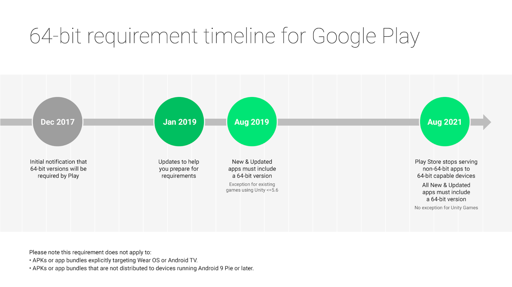

# 让您的应用程序为64位设备做好准备

原标题：Get your apps ready for the 64-bit requirement  
链接：[https://android-developers.googleblog.com/2019/01/get-your-apps-ready-for-64-bit.html](https://android-developers.googleblog.com/2019/01/get-your-apps-ready-for-64-bit.html)  
作者：Vlad Radu (Play产品经理)和Diana Wong (Android产品经理)  
翻译：[arjinmc](https://github.com/arjinmc)  

64位CPU为您的用户提供更快，更丰富的体验。添加64位版本的应用程序可以提高性能，为未来的创新腾出空间，并为仅使用64位硬件的设备启动。

我们希望帮助您做好准备并知道您需要时间进行规划。自Android 5.0 Lollipop以来，我们一直支持64位CPU，2017年我们首次[宣布](https://android-developers.googleblog.com/2017/12/improving-app-security-and-performance.html)使用native代码的应用程序必须提供64位版本（除了32位版本）。今天，我们将提供更详细的信息和时间表，以便在2019年尽可能轻松地过渡。

## 64位要求：对开发者意味着什么

从<strong>2019年8月1日</strong>开始：

* 除发布到Google Play的32位版本外，所有包含native代码的新应用和应用更新都需要提供64位版本。
* 扩展： Google Play将继续接受仅使用Unity 5.6或更早版本的现有游戏的32位更新，直到2021年8月。

从<strong>2021年8月1日</strong>开始：

* Google Play将停止在64位版本的设备上提供没有64位版本的应用，这意味着这些设备上的Play商店将不再提供这些应用。
* 这将包括使用Unity 5.6或更早版本构建的游戏。

### 该要求不适用于：

* 明确定位Wear OS或Android TV的APK或应用程序包，它们是目前不支持64位代码的外形。
* 未分发到运行Android 9 Pie或更高版本的设备的APK或应用程序包。

我们没有对32位支持的政策进行更改。Play将继续向32位设备提供应用程序。此要求意味着具有32位native代码的应用程序也需要具有其他64位版本。

  

## 准备64位要求

我们预计，对于大多数开发者来说，转向64位应该是直截了当的。许多应用程序完全使用非native代码（例如Java编程语言或Kotlin）编写，不需要更改代码。

<strong>所有开发者</strong>：以下概述了为了符合64位标准而需要采取的步骤。有关此过程的更详细概述，请参阅我们的深入[文档](https://developer.android.com/distribute/best-practices/develop/64-bit)。

<strong>检查您的APK或应用程序包</strong>的native代码。您可以使用[APK Analyzer](https://developer.android.com/studio/build/apk-analyzer)检查.so文件。确定它们是从您自己的代码构建还是由您正在使用的SDK或库导入。如果您的APK中没有任何.so文件，则您已经符合64位标准。

<strong>启用64位体系结构</strong>并重建由您自己的代码导入的native代码（.so文件）。有关详细信息，请参阅[文档](https://developer.android.com/distribute/best-practices/develop/64-bit)。

* 如果需要，<strong>将任何SDK和库升级到64位兼容版本</strong>。如果没有，则联系SDK或库所有者。我们正在与顶级库所有者合作，以实现64位兼容性。
* 重建应用后，在本地<strong>测试问题</strong>。
* 使用[测试追踪](https://support.google.com/googleplay/android-developer/answer/3131213?hl=en)<strong>进行测试</strong>，以进行全面测试。

<strong>游戏开发者</strong>：三个最常用的引擎目前都支持64位（自2015年以来的Unreal和Cocos2d，自2018年以来的Unity）。我们知道迁移第三方游戏引擎是一个需要很长时间的密集型过程。

由于Unity最近才开始在2017.4和2018.2版本中提供64位支持，因此我们准备使用5.6或更早版本的现有游戏自动扩展到8月2021年.Unity提供的[指南](https://docs.unity3d.com/Manual/UpgradeGuides.html)可以帮助您完成升级到64-的过程位兼容版本。

<strong>SDK和库所有者</strong>：尽快更新64位合规性，以便让应用程序开发者有时间适应，并让开发者知道。[登录并注册您的SDK](https://docs.google.com/forms/d/e/1FAIpQLSfpLu80YoKRpkb17s_Jxq3bQMmAvMBHjt3cnlECV-fasE3Tvg/viewform)，以接收有关可帮助您为客户提供服务的最新工具和信息的更新。

## 展望

对于那些已经支持64位的人 - 谢谢您出色的工作！如果您还没有，我们建议您尽快开始64位要求的工作。随着我们越来越接近截止日期，我们将更新我们的开发者文档，其中包含有关如何检查您的应用是否合规的更多信息。

我们对64位CPU带来人工智能，机器学习和沉浸式移动等领域的未来感到兴奋。支持64位为64位设备的高级计算功能以及仅支持64位代码的未来Android设备所支持的创新做好准备。