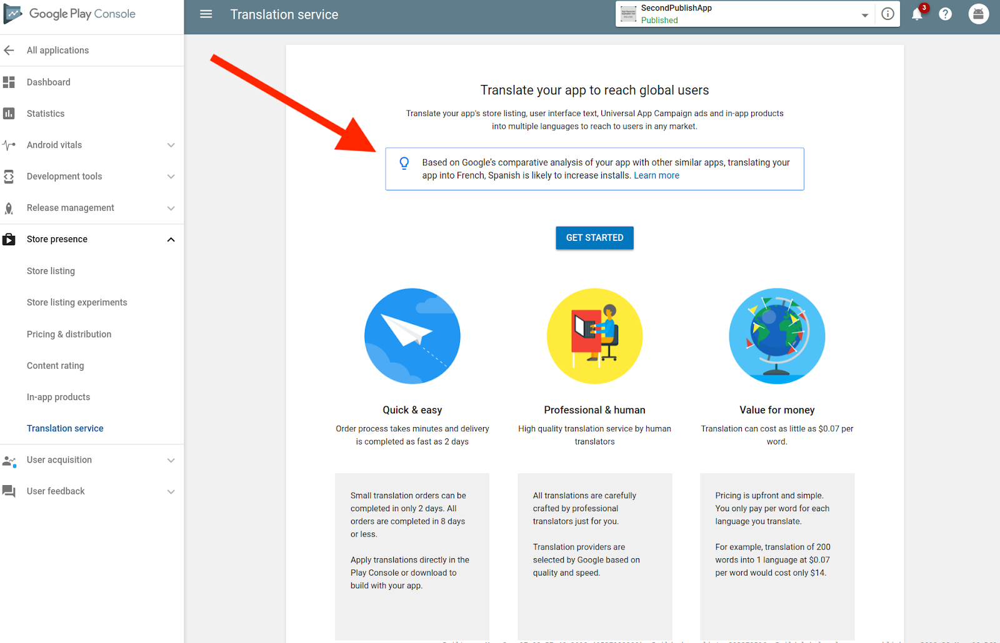

# 通过Google Play上的本地化扩展您的应用业务

原标题：Grow your app business internationally through localization on Google Play  
链接：[https://android-developers.googleblog.com/2019/01/grow-your-app-business-internationally.html](https://android-developers.googleblog.com/2019/01/grow-your-app-business-internationally.html)  
作者：Chris Yang (翻译服务项目经理)  
翻译：[arjinmc](https://github.com/arjinmc)  

在考虑是否本地化他们的应用程序时，开发者有以下问题和想法并不罕见：“我只是没有时间！” “翻译太贵了。” “高质量的翻译很难找到。”这听起来很熟悉吗？

在Google，我们认为翻译是使世界信息普遍可用和有用的关键组成部分。这一承诺不仅延伸到本地化我们自己的产品，还提供工具来帮助开发者和翻译人员更轻松地本地化他们的应用程序。

## 介绍Google Play App翻译服务

[Google Play应用翻译服务](https://support.google.com/l10n/#topic=6307483)在Google Play控制台中提供，可简化应用用户界面字符串，商店列表，应用内商品名称和通用应用广告系列广告的本地化。成千上万的开发者已经使用这项服务来覆盖全球数亿用户。

以下是它可以提供帮助的一些方法的概述：

1.快速简便 - 在几分钟内完成订购，并在短短两天内收到您的翻译。

* 小翻译订单只需两天即可完成。所有订单在八天或更短时间内完成。
* 直接在Play控制台中应用翻译或下载以使用您的应用进行构建。

2.专业和人性 - 通过真正的人工翻译获得高质量的翻译。

* 所有翻译均由专业翻译人员精心打造。
* Google会根据质量和速度选择翻译提供商。

3.物有所值 - 将您的应用翻译为每个词0.07美元。

定价是前期和简单的。您只需按翻译的每种语言付费。
例如，将200个单词翻译成一种语言，每个单词0.07美元只需14美元。

## 订购翻译

在Google Play控制台中查找[翻译服务](https://support.google.com/googleplay/android-developer/answer/3125566?hl=en)：

  

当您准备好翻译时，只需选择要用于翻译的语言，选择供应商并下订单。

  

选择要翻译的语言。

  

选择要翻译的内容类型。

  

轻松完成服务的购买。

## 语言建议

您还可以通过有助于增加安装的[翻译建议](https://support.google.com/googleplay/android-developer/answer/3125566#recommendations)来扩展您的全球足迹。可以在Google Play控制台中找到这些建议。

  

语言推荐功能是使用机器学习开发的，它基于您的应用程序的安装历史记录和市场数据。

您是否知道，只有[10种语言](https://en.wikipedia.org/wiki/Languages_used_on_the_Internet#Internet_users_by_language)，您可以覆盖全球近80％的互联网用户。特别是，[俄罗斯](https://android-developers.googleblog.com/2017/08/your-next-growth-market-on-google-play.html)和[中东](https://android-developers.googleblog.com/2017/05/why-you-should-localize-your-app-or.html)的Google Play机会继续增长。一旦您对这些市场进行了本地化，请告知我们，以便我们可以考虑在Play商店中使用[Now in Russian(现在在俄罗斯)](https://docs.google.com/forms/d/e/1FAIpQLSd8iXQoGnKTmkRLKeEp-U2Yie6l0ozQ5BR79ktVYtn2EUNlfw/viewform)和[Now in Arabic(现在在中东)](https://docs.google.com/forms/d/e/1FAIpQLSfuqUnnrY4a9XUsKlqrfow_7v9p1jMX_ae7DLnshk30pqOVZQ/viewform)集合来展示您的应用或游戏。

## 启动翻译

下载翻译后，您就可以在Google Play上发布新翻译的应用更新了。

立即[开始使用App Translation Service](https://support.google.com/l10n/#topic=6307483)，让我们知道您的想法！
