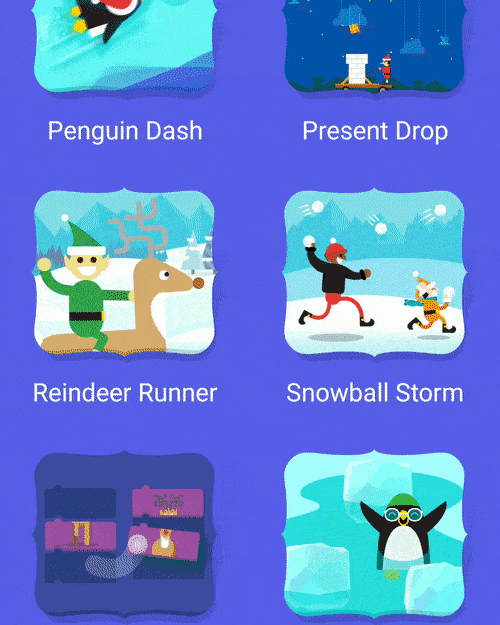
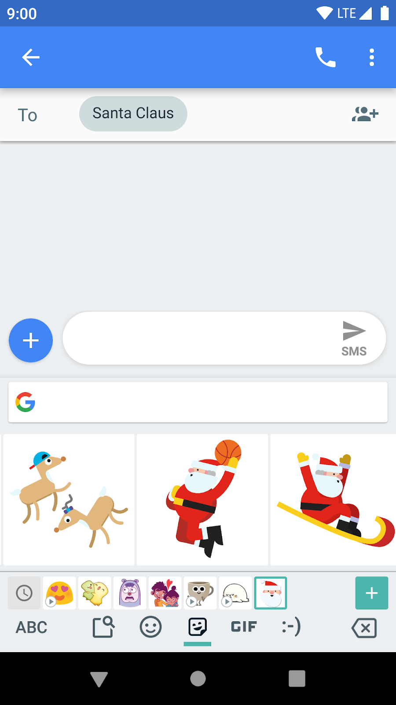

# Google发布适用于2018 Android的Santa Tracker源代码

原标题：Google releases source code of Santa Tracker for Android 2018  
链接：[https://android-developers.googleblog.com/2019/01/google-releases-source-code-of-santa.html](https://android-developers.googleblog.com/2019/01/google-releases-source-code-of-santa.html)  
作者：Chris Banes (Elf首席Android工程师)  
翻译：[arjinmc](https://github.com/arjinmc)  

今天，我们在[google/santa-tracker-android](https://github.com/google/santa-tracker-android)推送了Google的Santa Tracker 2018 Android应用程序的源代码 ，包括17款迷你游戏，圣诞老人追踪功能，Wear应用等等！

  

从视觉上看，今年的应用程序看起来大致相同，但是在应用程序内部，应用程序已经进行了大规模的缩小练习，以使Google Play的下载尽可能小。当用户下载该应用程序时，初始下载量仅为<strong>9.2MB</strong>，而去年的应用程序为60MB。这减少了<strong>85％</strong>！🗜️

## Android App Bundle

我们通过将应用程序迁移到使用[Android App Bundle](https://developer.android.com/guide/app-bundle/)来实现这种减少。主要好处是Google Play现在可以向用户的设备提供[动态优化的APK](https://support.google.com/googleplay/android-developer/answer/9006925)。此外，我们还能够将所有游戏分成他们自己的动态功能模块，按需下载。这就是为什么你第一次打开游戏时可能会看到进度条的原因，我们实际上是在开始游戏之前从Google Play下载游戏：

  
<strong><small>从Google Play获取游戏时显示的进度条</small></strong>

您可以在我们的一个小型博客系列中“[迁移到Android App Bundle](https://medium.com/androiddevelopers/google-santa-tracker-moving-to-an-android-app-bundle-dde180716096)”帖子中阅读更多关于迁移到App Bundle的旅程。

## Gboard表情

我们今年添加的新功能之一是Gboard表情包，允许用户与他们的朋友分享表情。您甚至可能会注意到表情中游戏中的一些角色！

  
<strong><small>'Santa Dunk'是20种可用表情之一</small></strong>

我们使用[Firebase应用程序索引](https://firebase.google.com/docs/app-indexing/)将表情发布到设备上的本地索引，Gboard键盘应用程序将其拾取，允许用户在应用程序中共享它们。你可以在[这里](https://github.com/google/santa-tracker-android/tree/master/santa-tracker/src/main/java/com/google/android/apps/santatracker/stickers/SantaTrackerStickers.kt)看到源代码。

  
<strong><small>表情包用于一个非常重要的对话</small></strong>

## 大量的代码改进

除了上面提到的事情之外，我们还完成了许多代码良好改进。我们已将最低SDK版本增加到Lollipop（21），从支持库迁移到[AndroidX](https://developer.android.com/jetpack/androidx/)，通过切换到现代格式减少了我们游戏资源的文件大小，以及许多其他小改进！😅。

## 去探索代码

如果您有兴趣，请查看代码并告诉我们您的想法。如果您有任何疑问或问题，请通过[问题跟踪器](https://github.com/google/santa-tracker-android/issues)告知我们。