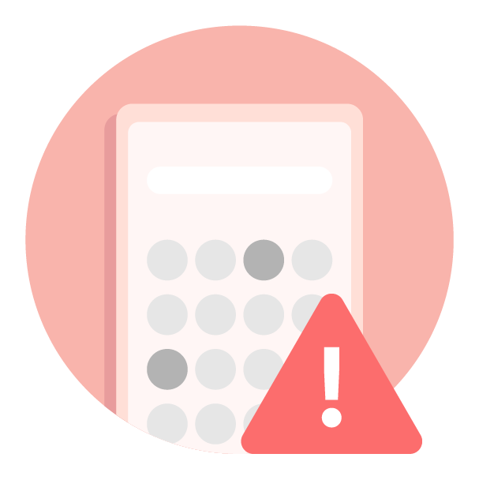

# 2018年我们如何与坏应用程序和恶意开发者进行斗争

原标题：How we fought bad apps and malicious developers in 2018  
链接：[https://android-developers.googleblog.com/2019/02/how-we-fought-bad-apps-and-malicious.html](https://android-developers.googleblog.com/2019/02/how-we-fought-bad-apps-and-malicious.html)  
作者：Andrew Ahn(Google Play产品经理)  
翻译：[arjinmc](https://github.com/arjinmc)  

  

Google Play致力于为数十亿Android用户提供安全，安全的平台，让他们发现和体验他们喜爱和享受的应用。为了履行这一承诺，我们去年致力于改进我们的滥用检测技术和系统，并大大增加了我们的产品经理，工程师，政策专家和运营领导者团队，以对抗不良行为者。

在2018年，我们推出了一系列新政策，以保护用户免受新的滥用趋势，更快地检测和删除恶意开发者，并阻止更多恶意应用程序进入Google Play商店。被拒绝的应用程序提交数量增加了55％以上，我们将应用程序暂停率提高了66％以上。这些增长可归因于我们不断努力收紧政策以减少Play商店中的有害应用程序数量，以及我们在自动保护和人工审核流程方面的投资，这些流程在识别和执行不良应用程序方面发挥着关键作用。

除了识别和阻止不良应用进入Play商店之外，我们的[Google Play Protect](https://www.android.com/play-protect/)系统现在每天扫描用户设备上超过500亿个应用，以确保设备上安装的应用不会以有害的方式运行。有了这样的保护，来自Google Play的应用程序损坏用户设备的可能性是其他来源的Android应用程序的八倍。

以下是我们去年一直关注的一些领域，这将继续成为我们2019年的优先事项：

  

## 保护用户隐私

保护用户的数据和隐私是建立用户信任的关键因素。我们一直要求开发者将他们的设备权限请求限制为提供应用程序功能所必需的。此外，为了帮助用户了解他们的数据使用情况，我们要求开发者提供有关敏感用户数据收集和使用的重要信息。去年，我们拒绝或删除了数万个不符合Play与用户数据和隐私相关政策的应用。

在2018年10月，我们[宣布了](https://android-developers.googleblog.com/2018/10/providing-safe-and-secure-experience.html)一项新政策，限制短信和通话记录权限的使用限制在少数情况下，例如应用程序被选为用户的默认应用程序，用于拨打电话或发送短信。我们最近开始从Google Play中删除违反此政策的应用。我们计划在整个2019年引入有关设备权限和用户数据的其他策略。

  

## 开发者诚信

我们发现超过80％的严重违规行为是由重复犯罪者和滥用开发者网络进行的。当恶意开发者被禁止时，他们通常会在黑市上创建新帐户或购买开发者帐户，以便返回Google Play。我们进一步增强了我们的群集和帐户匹配技术，通过将这些技术与我们的人工审核人员的专业知识相结合，我们使垃圾邮件开发者网络更难以通过阻止他们的应用程序首先发布来获得安装。

  

## 有害的应用内容和行为

正如去年的[博客文章](https://android-developers.googleblog.com/2018/01/how-we-fought-bad-apps-and-malicious.html)所述，我们与成千上万的模仿者，内容不当的应用程序以及[潜在有害应用程序](https://source.android.com/security/reports/Google_Android_Security_PHA_classifications.pdf)（PHA）进行了斗争。在与这些类​​型的应用程序的持续斗争中，我们不仅应用高级机器学习模型来发现可疑应用程序，还进行静态和动态分析，智能地使用用户参与和反馈数据，并利用熟练的人工审查，这有助于以更高的准确性和效率找到更多不良应用。

尽管我们已经增强并增加了对不良应用程序的防御层，但我们知道糟糕的开发者将继续试图通过改变策略和隐藏不良行为来逃避我们的系统。我们将继续增强抵御此类对抗行为的能力，并不断努力为我们的用户提供安全，安全的应用商店。