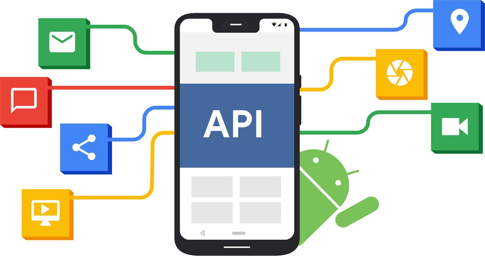

# 2019年目标API级别要求提高

原标题：Expanding target API level requirements in 2019  
链接：[https://android-developers.googleblog.com/2019/02/expanding-target-api-level-requirements.html](https://android-developers.googleblog.com/2019/02/expanding-target-api-level-requirements.html)  
作者：Edward Cunningham (Android安全和隐私团队)  
翻译：[arjinmc](https://github.com/arjinmc)  

  

在[之前的博客](https://android-developers.googleblog.com/2017/12/improving-app-security-and-performance.html)中，我们描述了API行为如何改变Android的安全性和隐私保护，并包括用户体验改进，防止应用程序意外过度使用电池和内存等资源。

自2018年11月以来，Google Play上的所有应用更新都需要针对API级别26（Android 8.0）或更高版本。由于成千上万的应用程序开发者的努力，Android用户现在使用现代API享受比以往更多的应用程序，带来了显着的安全和隐私优势。例如，在2018年期间，超过150,000个应用程序添加了对运行时权限的支持，使用户可以精确控制他们共享的数据。

今天我们提供了有关2019年Google Play要求的更多信息，并宣布了一些影响通过其他商店分发的应用的更改。

## 适用于2019年的Google Play要求

为了向用户提供最佳的Android体验，Google Play控制台将继续要求应用定位最近的API级别：

* <strong>2019年8月</strong>：要求新的应用程序针对API级别28（Android 9）或更高级别。
* <strong>2019年11月</strong>：要求对现有应用程序进行更新，以达到28级或更高级别的API。
未接收更新的现有应用程序不受影响，可以继续从Play商店下载。应用仍然可以使用任何应用[minSdkVersion](https://developer.android.com/guide/topics/manifest/uses-sdk-element.html#min)，因此您无法更改为旧Android版本构建应用的能力。

有关Android 9 Pie中引入的更改列表，请查看我们[目标API级别28+的应用的行为变更](https://developer.android.com/about/versions/pie/android-9.0-changes-28)页面。

## 通过其他商店分发的应用

无论应用程序的分发方式如何，定位最近的API级别都很有价值。在中国，来自华为，OPPO，Vivo，小米，百度，阿里巴巴和腾讯的主要应用程序商店[将要求](http://www.taf.net.cn/News_detail.aspx?_NOTICE_ID=231)应用程序在2019年达到API级别26（Android 8.0）或更高级别。我们希望其他许多应用程序引入类似的要求 - 一个重要的提高应用生态系统安全性的步骤。

我们在Play商店之外检测到的超过95％的间谍软件故意针对API级别22或更低级别，即使安装在最新的Android版本上，也可以避免运行时权限。为了保护用户免受恶意软件攻击并支持此生态系统计划，[Google Play Protect](https://www.android.com/play-protect/)会在用户尝试从未定位到最近API级别的任何来源安装APK时向用户发出警告：

* <strong>2019年8月</strong>：如果新应用未针对API级别26或更高级别，则会在安装期间收到警告。
* <strong>2019年11月</strong>：如果现有应用程序的新版本未针对API级别26或更高级别，则会在安装期间收到警告。
* <strong>2020年起</strong>：目标API级别要求将每年推进。

仅当应用程序[targetSdkVersion](https://developer.android.com/guide/topics/manifest/uses-sdk-element.html#target)低于设备API级别时，才会显示这些Play Protect警告。例如，安装任何针对API级别22或更低级别的新APK时，将警告具有运行Android 6.0（Marshmallow）的设备的用户。安装任何针对API级别25或更低级别的新APK时，将向安装了运行Android 8.0（Oreo）或更高版本的设备的用户发出警告。

在8月之前，Play Protect将在启用了[Developer选项](https://developer.android.com/studio/debug/dev-options)的设备上开始显示这些警告，以提前通知Play商店以外的应用程序开发者。为确保所有Android版本的兼容性，开发者应确保所有应用的新版本都针对API级别26+。

已发布（通过任何分发渠道）但未接收更新的现有应用程序不受影响 - 安装时不会向用户发出警告。

## 准备

有关如何更改应用程序目标API级别的建议，请查看[迁移指南](https://developer.android.com/distribute/best-practices/develop/target-sdk)和I / O 2018中的演讲：[将现有应用程序迁移到目标Android Oreo及更高版本](https://www.youtube.com/watch?v=YyDnYaFtRS0)。

我们非常感谢全球已经更新应用程序的Android开发者，以便为其用户提供安全性改进。我们期待在2019年共同取得重大进展。